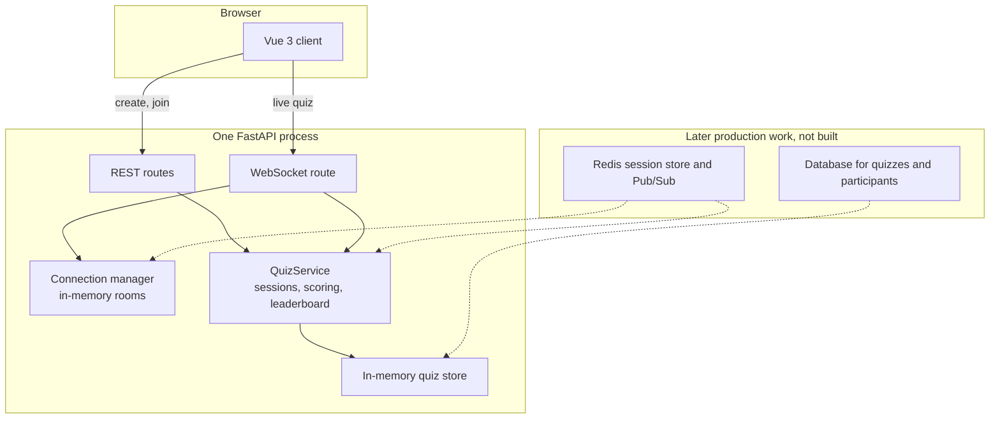

# System design: Real-Time Vocabulary Quiz

## Overview

This is a small live quiz for an English-learning app. Several people join the same quiz, answer vocabulary questions, and see scores change on a shared leaderboard. [how-it-works.md](how-it-works.md) is the short visual walkthrough.

The running system is one Vue app and one FastAPI process. Scores and WebSocket rooms live in that process. A database, Redis, and authentication are described below as later work. They are not part of this build.

### Main user flow

1. One person creates a quiz. The server returns a quiz ID.
2. Each person enters that ID and a display name and joins.
3. The page opens a WebSocket for that participant and shows the questions. The correct choice stays on the server.
4. A person selects one choice. The first answer for that question is final.
5. A correct first answer adds 1 point. A wrong answer adds nothing. A repeat does not change the score.
6. Everyone in that quiz receives the new leaderboard. People in another quiz do not.

A browser refresh reconnects the same participant and keeps the current question. Leaving the quiz clears that saved session. Restarting the API clears every session, because nothing is stored on disk.

## Architecture

The Vue dev server proxies `/quizzes` and `/ws` to `127.0.0.1:8000`, so the browser talks to one origin during local development.

Scoring is not a second service. `QuizService.submit_answer` validates the answer and updates the score. `QuizService.leaderboard` sorts the same session. The WebSocket handler calls those methods and does not keep a copy of the rules.

## Components

### Frontend application

The Vue 3 app is the join screen and the live quiz. `QuizJoin`, `QuizQuestion`, `Leaderboard`, and `ConnectionStatus` render the page. `useQuizSocket` joins through REST, owns the WebSocket, and holds the questions, score, and leaderboard. The leaderboard is shown in the order the server sends. A row flashes when that person's score goes up.

### WebSocket communication

`ws.py` accepts `/ws/quizzes/{quiz_id}/participants/{user_id}` after a REST join. It checks that the quiz and participant exist, sends the current questions and leaderboard, and reads `submit_answer` messages.

`ConnectionManager` keeps one room per quiz: `quiz_id` to `user_id` to socket. A second socket for the same participant replaces the first. A failed send removes only that socket. Other people in the room still get the broadcast.

### Quiz and session management

`InMemoryQuizStore` is a dictionary of sessions guarded by a lock. Creating a quiz copies five fixed vocabulary questions into a new session. Joining adds a participant with a new id and a score of 0. Sessions do not share participants or answers.

### Scoring

`submit_answer` is the only place a score changes.

- The quiz, participant, question, and choice must exist.
- The first stored answer for that person and question wins.
- A matching choice adds 1 point. Any other allowed choice adds 0.
- A later submit returns the existing result and does not write again.

The public question payload has `question_id`, `prompt`, and `choices`. It does not include `correct_choice`.

### Leaderboard

`leaderboard` reads the session and sorts by score descending, then display name using case-insensitive order, then `user_id`. Ranks start at 1. The WebSocket broadcasts that list only after a new answer is stored. A duplicate answer is returned to the sender and is not broadcast.

A lock per quiz wraps the submit, the leaderboard read, and the broadcast, so two answers in the same quiz are applied one at a time and listeners see boards in order.

### Tests

Backend tests use pytest. REST tests use FastAPI's `TestClient`. WebSocket tests start one Uvicorn process and connect with the `websockets` client, so every socket shares the server event loop. Frontend tests use Vitest, Vue Test Utils, and jsdom. They mock `fetch` and `WebSocket`. They do not mock `QuizService`.

## Data flow

1. **Join.** The browser sends `POST /quizzes/{quiz_id}/participants` with `{ "display_name": "Ada" }`. The service checks the quiz, stores the participant, and returns `user_id`, `display_name`, and `score`.
2. **Connect.** The browser opens `/ws/quizzes/{quiz_id}/participants/{user_id}`. The server loads that participant and the questions. It sends a `connected` message, then a `leaderboard` message, including the new person at score 0 to people already in the room.
3. **Submit.** The browser sends `{ "type": "submit_answer", "question_id": "q1", "choice": "ephemeral" }`.
4. **Validate.** The message must be that JSON object. The service then checks the participant, the question, and that the choice is one of the question's choices.
5. **Score.** If this is the first answer, the service stores it and adds 1 point when the choice matches. The socket replies with `answer_result`: `question_id`, `correct`, and `score`.
6. **Leaderboard.** The service sorts the session again.
7. **Broadcast.** The connection manager sends `{ "type": "leaderboard", "leaderboard": [...] }` to every open socket in that quiz.

Invalid JSON, an unknown quiz, an unknown participant, an unknown question, a bad choice, and a repeat each return an `error` message to that client. A repeat uses the code `already_answered` and includes the original `correct` flag and score.

## Technology choices

| Choice | Why it is used here |
|---|---|
| Python | The assessment allows a language the author can explain. The session rules are a small, typed module. |
| FastAPI | One process serves the REST checks and the WebSocket endpoint, with Pydantic checking the join body and the answer message. |
| Vue 3 + TypeScript | The screen is a few components plus one composable. TypeScript keeps the server messages explicit: `connected`, `answer_result`, `leaderboard`, and `error`. |
| WebSockets | A score change must reach the other people in the quiz without them polling. The browser API is enough for this client. |
| `websockets` | The installed Uvicorn build cannot finish a WebSocket upgrade without a protocol library. This is the small library that does that. The larger `uvicorn[standard]` extra was not added. |
| pytest | The scoring rules and the live room are tested against the real service. |
| Vitest and Vue Test Utils | The join form, socket state, and the screen path from join to a score of 1 are tested without a running API. |

## Current implementation and later production work

### Scalability

**Current.** One API process owns the sessions and the sockets. Quizzes are isolated by id. That is enough for a demo with several people in a few quizzes. A process restart drops every session. The page then asks the person to join again.

Room locks for finished quizzes stay in memory. Each lock is small. Removing one while a new connection is starting could let two answers run at once, so this build does not evict them.

**Later.** More than one API process needs a shared session store, such as Redis, so every process reads the same scores. Each process would still own its own sockets. Redis Pub/Sub, or a similar bus, would publish the leaderboard for a quiz id, and each process would forward it to the local room. A database is the point at which quizzes and participants must survive a restart. Those pieces replace the process-local lock and the in-memory dictionary. They are not in this repository.

### Performance

**Current.** The leaderboard is a sort of one quiz's participants, not a global table. The broadcast goes to that room only. A duplicate answer does not broadcast. The socket handler is async. The room lock keeps one quiz's updates ordered. There is no background worker, because the work for one answer is a dictionary update and a short send.

**Later.** A popular quiz would publish one leaderboard message onto the bus instead of hoping one process holds every socket. The score write would stay in the shared store so two processes cannot both accept a first answer.

### Reliability

**Current.** Unknown quizzes, unknown participants, bad messages, and bad choices return a structured error. An unexpected exception on one socket is logged and sent to that client as `server_error`. A closed socket is removed. The others still receive later boards. The browser disables submit unless the socket is open, restores the same participant after refresh, and clears that session on leave or when the quiz is gone.

Logs go to stdout from the `app` logger: connect, disconnect, answer scored, rejected socket, invalid message, and dropped socket.

**Later.** Production logs would be structured and shipped with the quiz id and participant id. Useful signals would be connected clients per quiz, answer errors, broadcast failures, and time from submit to broadcast. A restart would reload sessions from the database. The client behavior for a missing quiz can stay: drop the saved session and return to the join form.

### Security

**Current.** Display names are trimmed and limited to 40 characters. Blank ids and blank choices are rejected. A choice must be one of the question's choices. Correct answers are not sent with the questions.

The participant id is the only check on the socket. Anyone who knows a quiz id and a participant id can connect as that person. Anyone who knows a quiz id can also read that quiz's leaderboard. There is no login, no rate limit, and the local demo uses `ws` on localhost through the Vite proxy. An update in one quiz is not written into another session and is not broadcast to the other room.

**Later.** Participants would authenticate, and the socket would accept a short-lived credential instead of a reusable id. Public traffic would use `wss`. Join and submit routes would be rate limited. Those controls are design notes only.
